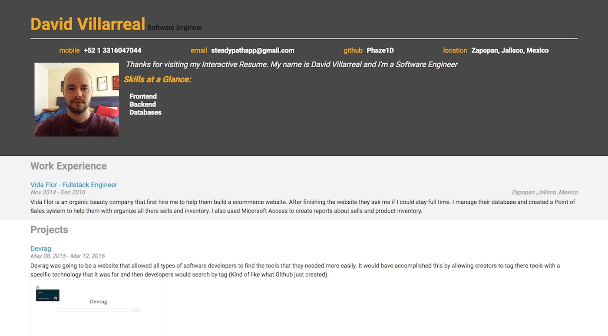

# Online Resume
> Udacity Frontend Nanodegree Project 4

This project was meant to test my comprehension of DOM manipulation with Jquery.

## Development
I build a Javascript file with all my resume information and then I had to display that information on a website using JQuery to add DOM elements, instead of manually adding a bunch of HTML elements. This method is meant to show how DOM manipulation can keep code DRY and reusable.

### Usage
If you want to look at the results just open [index.html](index.html) file in you default browser.
